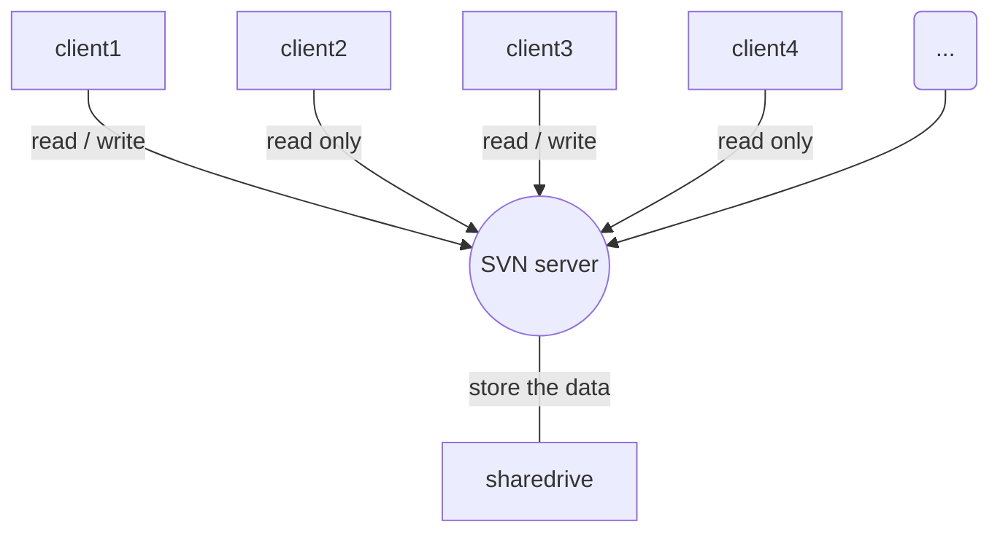

# Storm技术内幕与大数据实践笔记

周健华 2016年10月


## 序

LinnkdIn 基于Kafka 开发了,Samza用于实时新闻推送,广告和复杂监控.

1号店使用经验.


## 1绪论

1. Nimbus 和 Supervisor 通信通过ZooKeeper完成.
1. storm 0.8版本开始**executor**为具体物理线程. 同一个spout/bolt的task可能会共享一个物理线程.


- Apache kafka
消息队列

消息队列技术是分布式应用间交换信息的一种技术。消息队列可驻留在内存或磁盘上, 队列存储消息直到它们被应用程序读走。通过消息队列，应用程序可独立地执行--它们不需要知道彼此的位置、或在继续执行前不需要等待接收程序接收此消息。在分布式计算环境中，为了集成分布式应用，开发者需要对异构网络环境下的分布式应用提供有效的通信手段。为了管理需要共享的信息，对应用提供公共的信息交换机制是重要的。常用的消息队列技术是 Message Queue。

Apache kafka 经常当做数据缓冲区.

- Apache Thrift 
可伸缩的跨语言服务开发框架
Apache Thrift 是 Facebook 实现的一种高效的、支持多种编程语言的远程服务调用的框架。

 Facebook 开发的远程服务调用框架 Apache Thrift，它采用接口描述语言定义并创建服务，支持可扩展的跨语言服务开发，所包含的代码生成引擎可以在多种语言中，如 C++, Java, Python, PHP, Ruby, Erlang, Perl, Haskell, C#, Cocoa, Smalltalk 等创建高效的、无缝的服务，其传输数据采用二进制格式，相对 XML 和 JSON 体积更小，对于高并发、大数据量和多语言的环境更有优势

### Jstorm


## 2实时平台介绍

## 3Storm集群部署和配置

## 4Storm内部剖析

- 分配 executor
执行 mk-assignments 把各个executor分配到对应的节点和端口

mk-assignments 功能:产生executor 与 节点+端口的对应关系

**一个端口可以作为一个slot**

一个slot可以运行一个worker进程.

- 调度器

1. schedule(topologies,cluster)
1. topologies包含topology的静态信息
1. cluster包含topology的运行信息

- Nimbus
核心,调度和分配,客户端命令,客户端UI请求

- 均衡调度器evensheduler

优先考虑分配在不同的slot上.

将系统的可用资源均匀的分配给需要任务的多个topology


all-solt 集合为 [节点,端口]

- 默认调度器 defaultScheduler()

和均衡调度器evensheduler基本一致,只是在为topology分配任务前先释放掉topology不需要的资源.
**然后调用均衡调度器evensheduler**

计算当前集群中可以分配的slot资源,并判断当前分配给运行topology的slot是否需要重新分配.然后对提交的topology进行资源分配.

- Isolatilonscheduler

可以为某些topology指定需要的机器资源(机器数目)配置时指定

优先分配这些opology,保证分配给某个topology的机器只能运行这个特定的topology.


- 调度不均衡的问题.
sort-slots
<storm 源码分析 P123>
机器 a,b,c 分别有3个端口.
slot传入的集合.
```
a1,b1,c1,a2,b2,c2,a3,b3,c3
```

1. 按照supervisor-id分组
集合为
```
a1,a2,a3,b1,b2,b3,c1,c2,c3
```
2. 调用interleave-all方法处理,取出每个集合的第一个元素
```
取出 a1,b1,c1
```
3. 然后调用interleave-all递归处理下面的的集合
最终的结果
```
a1,b1,c1,a2,b2,c2,a3,b3,c3
```

- 调度存在的问题,导致资源分配不均.**分配时没有考虑,CPU和内存**



## 5Storm运维监控
## 6Storm扩展
## 7Storm开发
## 8基于Storm的实时数据平台
## 9大数据应用案例
## 10使用经验和优化
